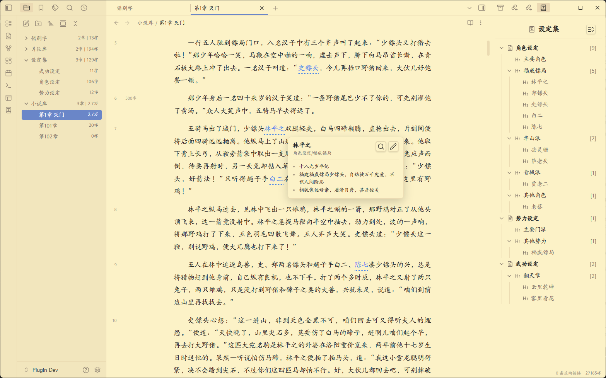
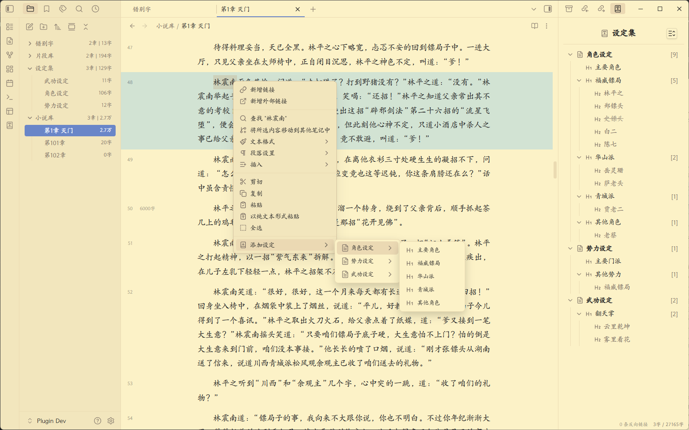
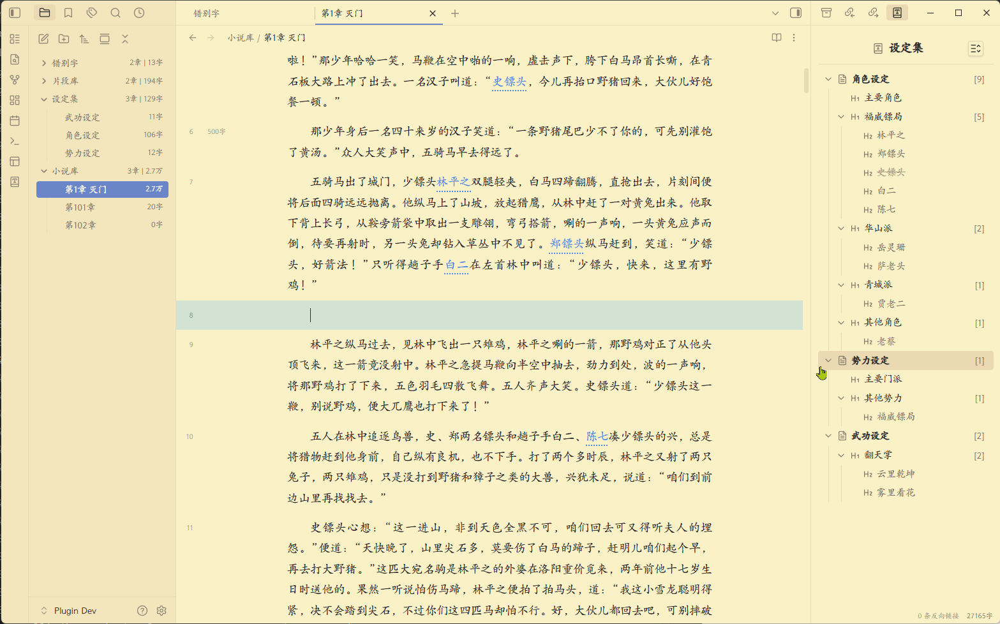
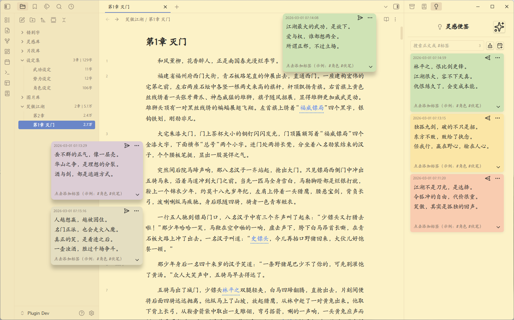
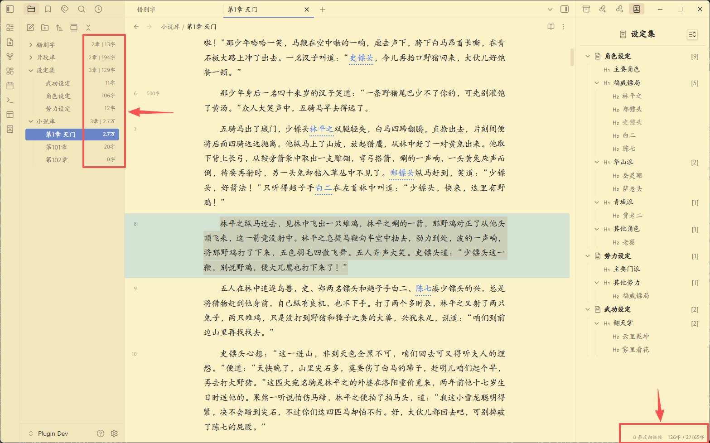
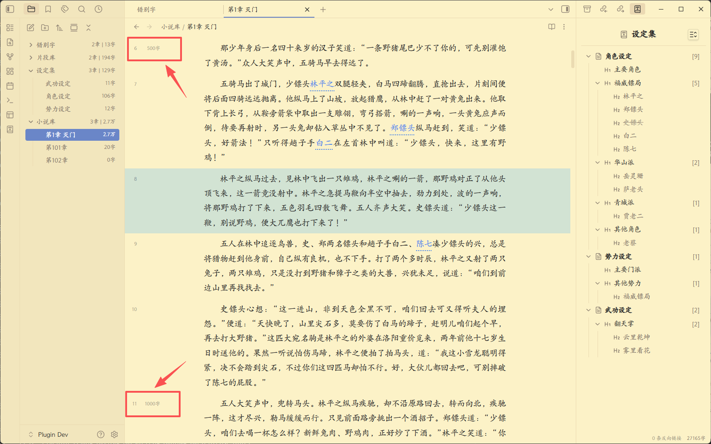
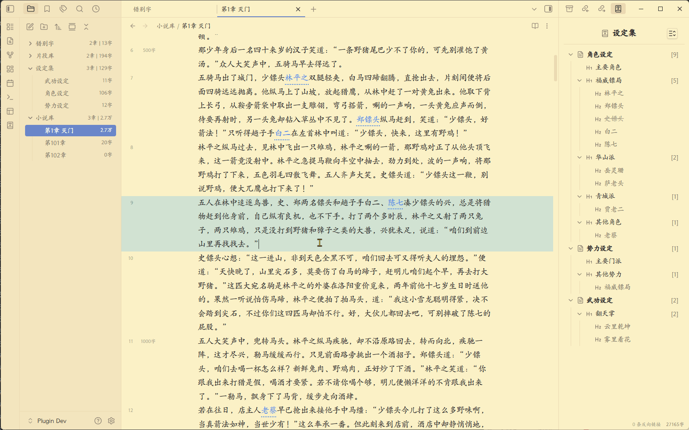
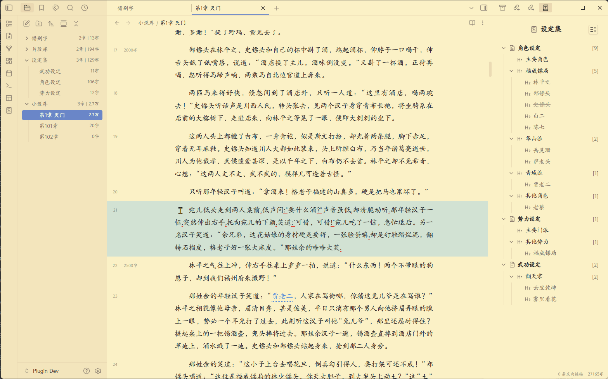
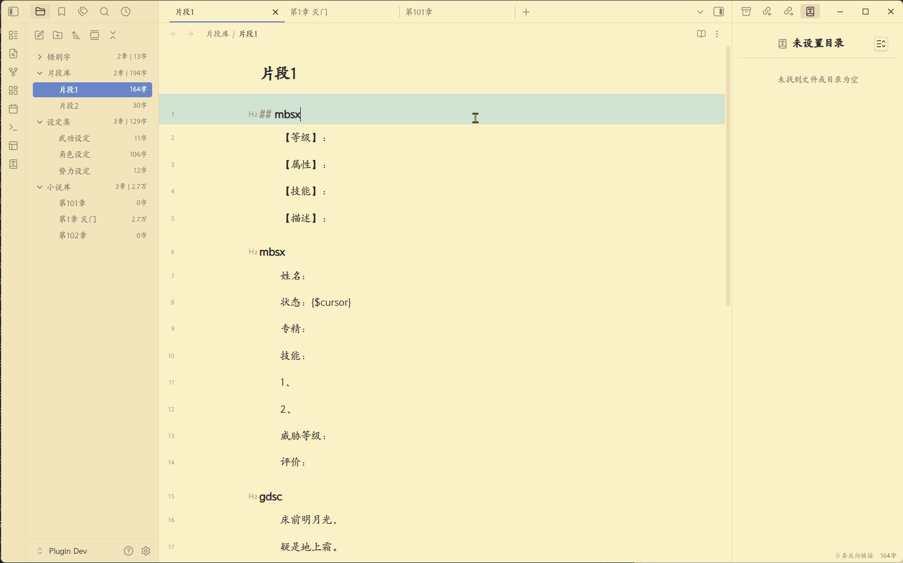
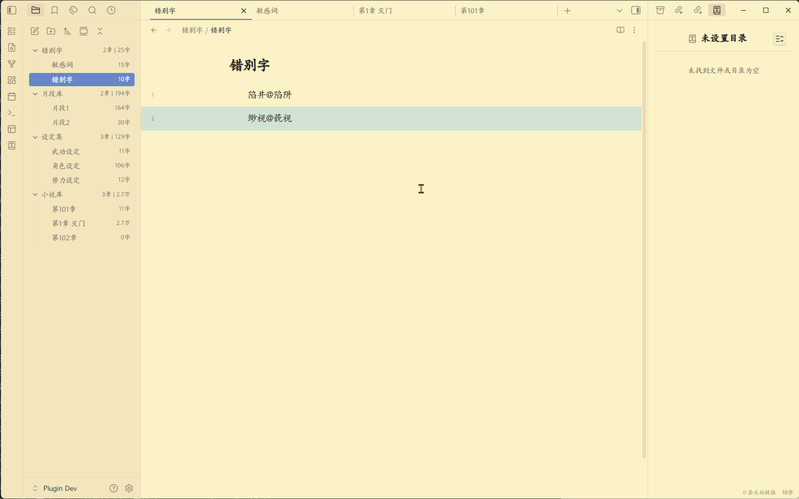

<div align="center">
    <h1>Chinese Novel Assistant - 中文小说写作助手</h1>
    
    
    
    
    
</div>

---

简体中文 | [English](#english)

一款辅助中文小说作者写作的 Obsidian 插件，提供一系列开箱即用的便捷功能。

**注意：所有功能仅支持桌面版，且仅在Win11下充分测试。**

---

## ✨设定库及关键字高亮功能

- 灵活、方便地**建立自己的小说设定库**，并提供右边设定视图，方便进行分类、排序和整理
- 同时提供正文内的**设定关键字高亮**，鼠标悬停高亮时，显示设定的具体内容，提供写作时的提醒
- 设定库文件本质上只是一个**本地的、普通的md文件**，也可直接打开编辑



---

## ✨右键菜单快速添加设定

- 无需离开当前页面，鼠标选中文本并点击右键菜单即可将其添加入设定库
- 添加时还可以选择现有的设定分类，对其进行预归类



---

## ✨正文中快速引用现有设定

- 在正文中输入"//+中文检索词"即可直接引用现有设定，减少前后设定不一致问题
- "中文检索词"支持**模糊搜索**，并提供类似输入法的下拉预选栏方便进行选择



---

## ✨灵感便签功能

- 提供命令快速在界面上创建悬浮的灵感便签，方便你记录灵感
- 提供独立的右边栏界面，方便对便签进行归档、整理和搜索
- 每个便签实际上也是独立的**md文件**，数据完全开放



---

## ✨更准确的中文字数统计

- 在按字符(character)统计字数的基础上，针对小说字数统计进行了优化
- 除右下角字数统计外，在左侧文件管理器上，也增加了同步的章节和字数统计



---

## ✨侧边栏字数里程碑（每500字）

- 在行号右侧，添加字数里程碑显示，方便了解本章写作进度



---

## ✨编辑区排版功能：行首缩进、行间距、段间距

- 提供行首缩进、行间距、段间距设定，提高阅读、写作时的浏览体验



---

## ✨常见英文标点检测与修复

- 提供中文文本中，自动检测错误英文标点的功能
- 提供手动修复英文标点错误命令，可批量手动修复检测出的英文标点

---



## ✨正文快速输入自定义文本片段

- 可自定义文本片段，并提供快速输入片段功能
- 文本片段本质上只是**本地的md文件**，可自己打开编辑

---



## ✨自定义错别字和敏感词检测与修复

- 可自定义错别字和敏感词，会在正文对其进行检测和提示
- 提供手动修改错别字和敏感词命令，可批量手动修复检测出的错别字和敏感词



---

# 使用方法

## 安装插件：
1. 在官方插件库搜索 chinese novel assistant
2. 下载插件并等待安装完成
3. 启用插件并进行设置


## 配置插件
1. 在插件设置界面，添加小说库。
2. 插件会自动在小说库内添加一系列的"功能库"，包括"设定库"、"便签库"、"片段库"和"纠错词库"。
3. 设定库就是保存设定文件的目录，里面放各种设定文件（md格式）。
4. 便签库就是便签文件的目录，里面放各种便签（md格式）。
5. 片段库就是放各种自定义的快捷输入片段的文件目录，里面放各种文本片段（md格式）。
6. 纠错词库里面放的是各种纠错词典，里面放各种纠错词典（md格式）。
7. 其他功能配置详情见配置界面具体设置说明。

## 设定库内文件格式约定

设定库内文件需遵守一定的格式约定：
1. 每个独立的文件即一组设定集合，文件名即设定集名
2. 文件内的每个h1标题（# 标题）即设定分类，标题名即分类名
3. h1下的每个h2标题（## 标题）即设定，标题名即设定名
4. h2下的内容即设定的具体内容
5. 设定中包括"【别名】"字符后的内容，会被处理为该设定的别名，多个别名以"，"号隔开
6. 设定中包括"【状态】"字符后的内容，会被处理为该设定的状态，目前支持"死亡"和"失效"两种状态，这两种状态下，右边栏内的设定，会被灰化并打上删除线
7. 注意：h3及以下标题不会被解析为设定，孤立的h2也不会被解析

下面是一个例子：

```
# 主要角色

## 令狐冲
- 华山派大弟子，性格不羁爱自由，重视情义被正派视为不分正邪。

## 任盈盈
【别名】盈盈，圣姑
- 魔教教主任我行的女儿日月神教教主，任我行之女，东方不败尊其为圣姑，左道群豪奉若神明。
- ...

# 其他角色

## 林震南
- 【状态】死亡
- 威震江南的福威镖局总镖头，虽然武功低微，以高明生意手腕威震江南。他迎娶了洛阳金刀门王元霸之女为妻，即王夫人，两人育有一子林平之，林平之后来又娶了岳灵珊。


```

---

## 文本片段格式约定

如果要使用文本片段功能，需遵守以下约定：
文件内的每个h2的标题名，即该文本片段的关键字（key），注意key只支持英文字符

下面是一个例子：

```

## mbsx
【等级】：
【属性】：
【技能】：
【描述】：

## gdsc
床前明月光，
疑是地上霜。
举头望明月，
低头思故乡。

```

---

## 自定义错别字与敏感词词典格式约定

如果要使用自定义错别字与敏感词功能，需设置相应词典，词典文件（md文件）需遵守以下约定：
1. 文件内的每行是一个有错别字的词及其正确版，格式为"错别词[空格]正确词"
2. 错别词在正文内出现时，会被标红提示
3. 如果错别词后有"[空格]正确词"，当使用插件提供的命令批量修改错别词时，会自动将错别词替换为正确词

下面是词典例子：

```
陷井 陷阱
缈视 藐视

```

---

## 📝 命令列表

通过 `Ctrl/Cmd+P` 访问这些命令：

- **自动修正当前文档标点问题** - 自动修正当前文档的英文标点和中文标点不配对问题
- **自动修正当前文档错别字和敏感词** - 自动修正当前文档的错别字和敏感词（错别字和敏感词需自定义）

---

## 🤝 支持

如果您觉得 chinese novel assistant 有帮助，请考虑支持其开发：

- [⭐ 在 GitHub 上给项目加星](https://github.com/pingo8888/chinese-novel-assistant)
- [🐛 报告问题或建议功能](https://github.com/pingo8888/chinese-novel-assistant/issues)

---

## 📄 许可证

MIT License - 可自由使用和修改。

---

---

## English

[简体中文](#) | English

An Obsidian plugin designed for Chinese fiction authors, with a set of practical features ready to use out of the box.

**Note: all features are desktop-only, and have been fully tested mainly on Windows 11.**

---

### ✨ Worldbuilding library and keyword highlight

- Build and manage your own **worldbuilding library** flexibly and conveniently, with a right sidebar view for classification, sorting, and organization.
- Highlights **worldbuilding keywords** inside your manuscript. Hovering over a highlighted keyword shows the detailed entry as a writing reminder.
- Worldbuilding files are essentially **local, plain Markdown files**, so you can open and edit them directly.


---

### ✨ Quick add worldbuilding from right-click menu

- Add selected text to the worldbuilding library directly from the context menu without leaving the current page.
- You can also pre-assign the new entry to an existing category during creation.


---

### ✨ Quick reference existing worldbuilding in manuscript

- Type `//+Chinese keyword` in your manuscript to quickly reference existing entries and reduce consistency issues.
- The Chinese keyword supports **fuzzy search** and provides an IME-like dropdown candidate panel for quick selection.


---

### ✨ Sticky note feature for inspiration

- Use commands to quickly create floating inspiration sticky notes in the workspace.
- Includes a dedicated right sidebar for archiving, organizing, and searching notes.
- Each note is also an independent **Markdown file**, with fully open data.


---

### ✨ More accurate Chinese character count

- Optimized for fiction writing on top of basic character counting.
- In addition to the bottom-right counter, synced chapter/character counts are also shown in the left file explorer.


---

### ✨ Sidebar writing milestones (every 500 characters)

- Adds milestone markers near line numbers to help track chapter progress while writing.


---

### ✨ Editor typography: first-line indent, line spacing, paragraph spacing

- Configure first-line indentation, line spacing, and paragraph spacing to improve reading and writing experience.


---

### ✨ Common English punctuation detection and fix

- Automatically detects incorrect English punctuation in Chinese text.
- Provides manual commands to batch-fix detected punctuation issues.

---


### ✨ Quick insert custom text snippets

- Supports custom snippets and fast snippet insertion.
- Snippets are essentially **local Markdown files**, which you can edit directly.

---


### ✨ Custom typo and sensitive-word detection and fix

- Define your own typo/sensitive-word dictionary for detection and highlighting in manuscript text.
- Provides manual commands to batch-fix detected typos and sensitive words.


---

### Usage

#### Install plugin
1. Search for "chinese novel assistant" in the official community plugin market.
2. Download the plugin and wait for installation to complete.
3. Enable the plugin and configure its settings.

#### Configure plugin
1. Add one or more novel libraries in plugin settings.
2. The plugin will automatically create several feature folders in each novel library: worldbuilding library, sticky note library, snippet library, and proofreading dictionary library.
3. The worldbuilding library stores worldbuilding files (Markdown).
4. The sticky note library stores note files (Markdown).
5. The snippet library stores custom quick-insert snippet files (Markdown).
6. The proofreading dictionary library stores typo/sensitive-word dictionary files (Markdown).
7. See the settings page for detailed options of other features.

#### Worldbuilding file format conventions

Files in the worldbuilding library should follow these conventions:
1. Each file is a worldbuilding collection; file name = collection name.
2. Each H1 (`# Heading`) in the file is a category; heading text = category name.
3. Each H2 (`## Heading`) under an H1 is an entry; heading text = entry name.
4. Content under an H2 is the detailed entry content.
5. Content after `【别名】` is treated as aliases of the entry, separated by `，`.
6. Content after `【状态】` is treated as entry status. Currently supports `死亡` (dead) and `失效` (invalid). Entries in these states are grayed out with strikethrough in the right sidebar.
7. H3 and lower headings are not parsed as entries. Standalone H2 without a valid H1 hierarchy is also not parsed.

Example:

```
# 主要角色

## 令狐冲
- 华山派大弟子，性格不羁爱自由，重视情义被正派视为不分正邪。

## 任盈盈
【别名】盈盈，圣姑
- 魔教教主任我行的女儿日月神教教主，任我行之女，东方不败尊其为圣姑，左道群豪奉若神明。
- ...

# 其他角色

## 林震南
- 【状态】死亡
- 威震江南的福威镖局总镖头，虽然武功低微，以高明生意手腕威震江南。他迎娶了洛阳金刀门王元霸之女为妻，即王夫人，两人育有一子林平之，林平之后来又娶了岳灵珊。


```

---

#### Snippet format conventions

To use snippets, follow these conventions:
The title text of each H2 is treated as the snippet key. Note that keys currently support English characters only.

Example:

```

## mbsx
【等级】：
【属性】：
【技能】：
【描述】：

## gdsc
床前明月光，
疑是地上霜。
举头望明月，
低头思故乡。

```

---

#### Custom typo and sensitive-word dictionary format

To use custom typo/sensitive-word detection, configure a dictionary file (Markdown) with the following rules:
1. Each line contains one wrong term and its correction, in format: `wrong_term[space]correct_term`
2. When a wrong term appears in manuscript text, it will be highlighted.
3. If a correction exists after a space, the plugin's batch-fix command will automatically replace the wrong term with the correction.

Example:

```
陷井 陷阱
缈视 藐视

```

---

### 📝 Commands

Access these commands with `Ctrl/Cmd+P`:

- **Auto-fix punctuation issues in current document** - Auto-fixes English punctuation and unmatched paired Chinese punctuation.
- **Auto-fix typos and sensitive words in current document** - Auto-fixes typos and sensitive words in current document (requires your custom dictionary).

---

### 🤝 Support

If Chinese Novel Assistant helps you, please consider supporting the project:

- [⭐ Star the project on GitHub](https://github.com/pingo8888/chinese-novel-assistant)
- [🐛 Report issues or request features](https://github.com/pingo8888/chinese-novel-assistant/issues)

---

### 📄 License

MIT License - free to use and modify.

---

**Made with ❤️ by [pingo8888](https://github.com/pingo8888)**
