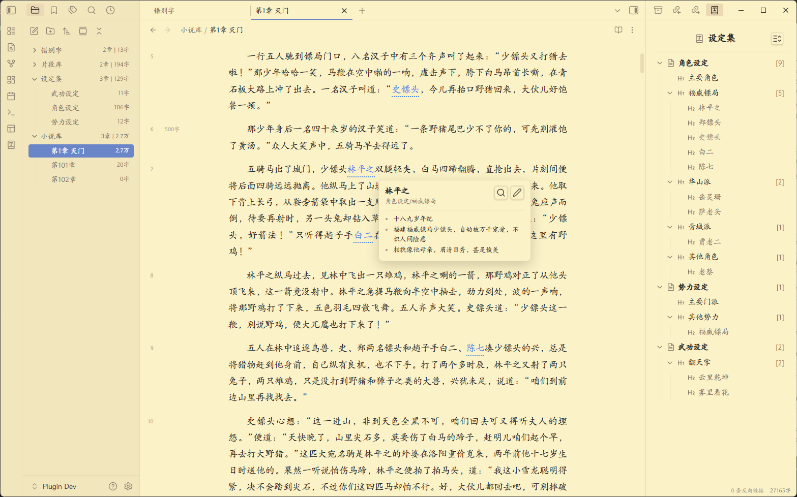
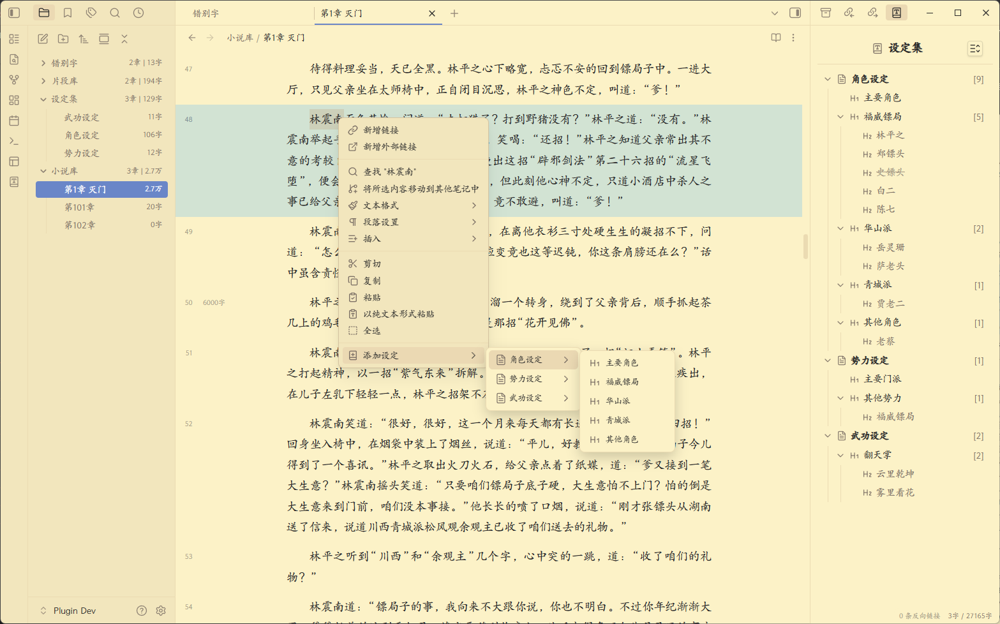
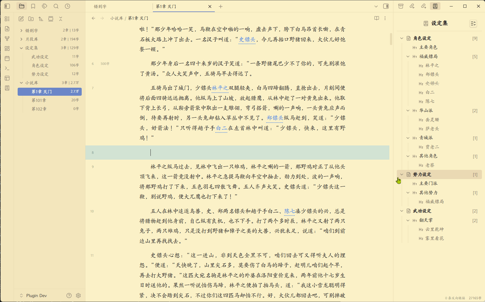
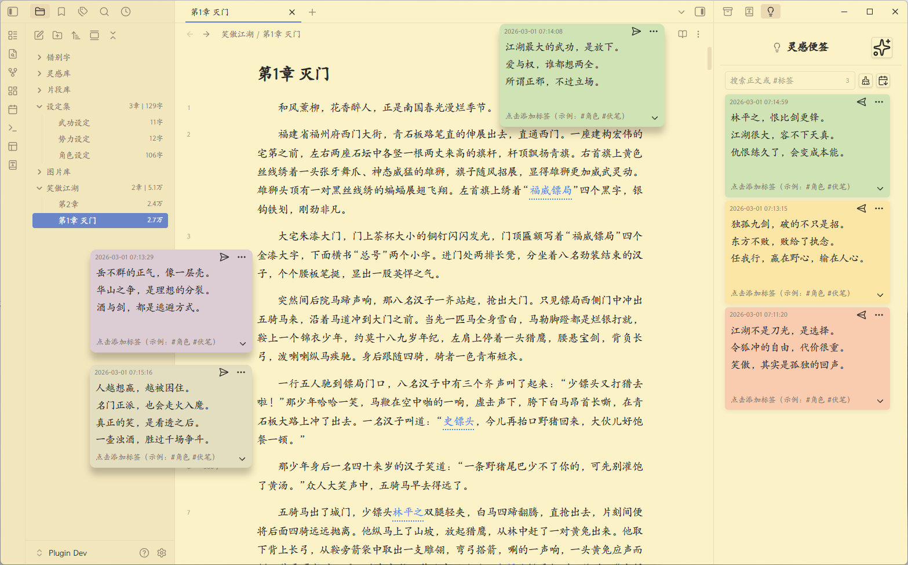
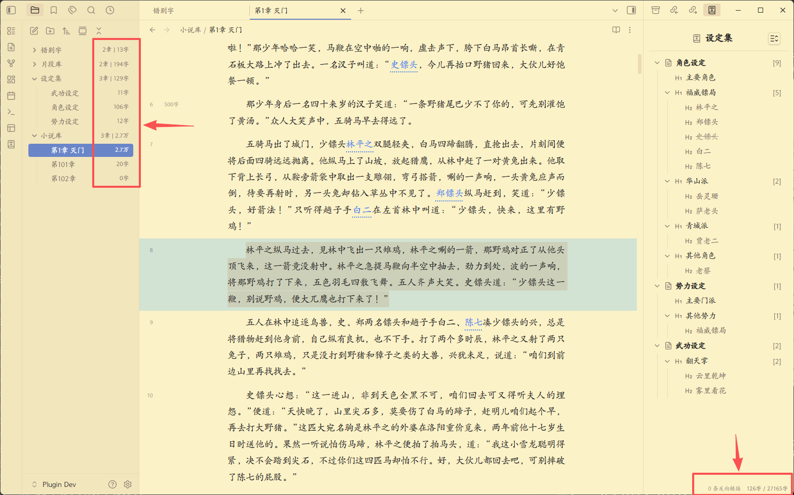
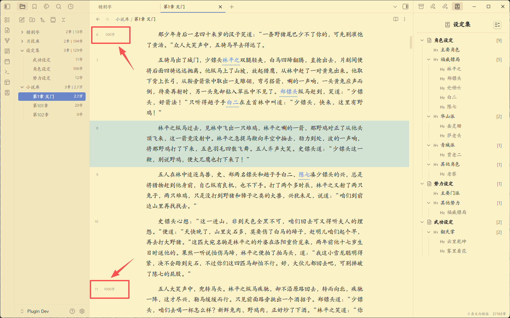
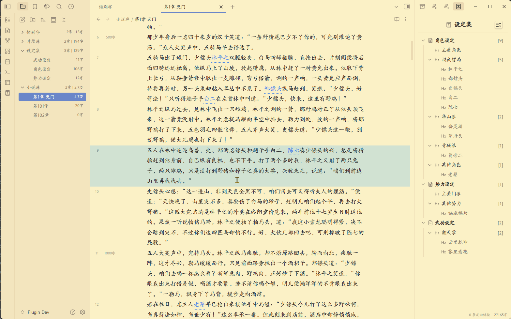
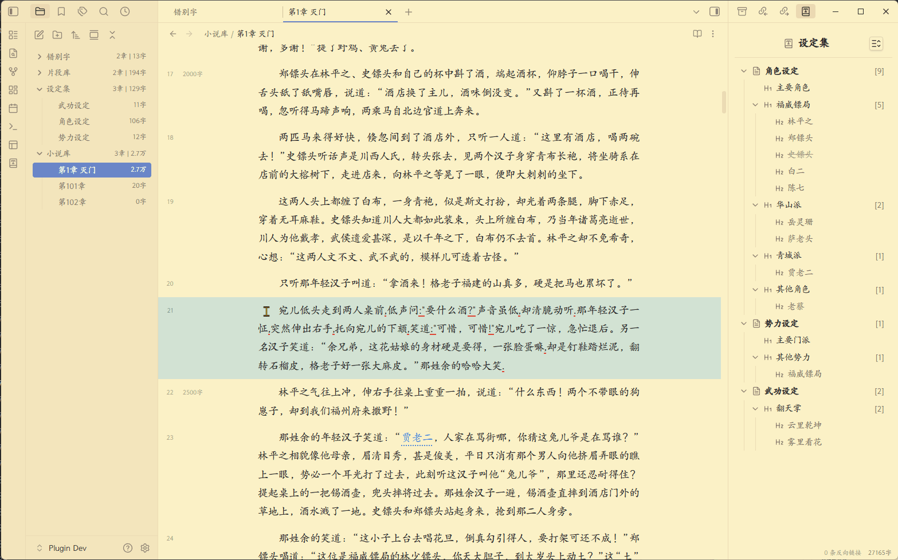
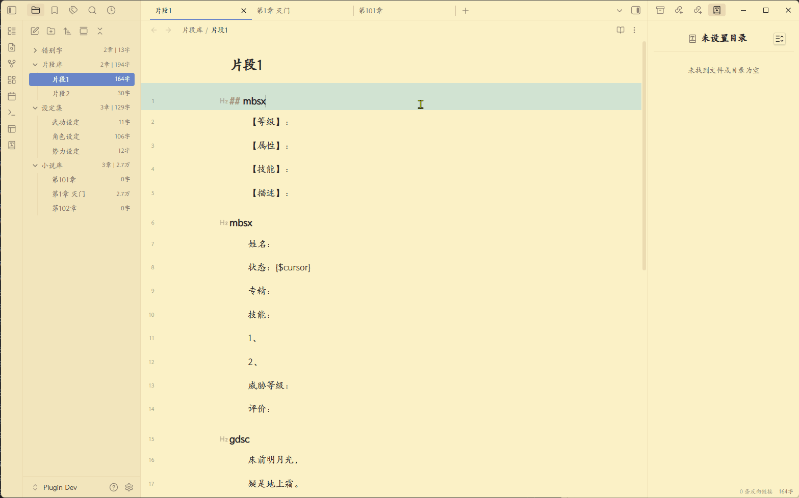
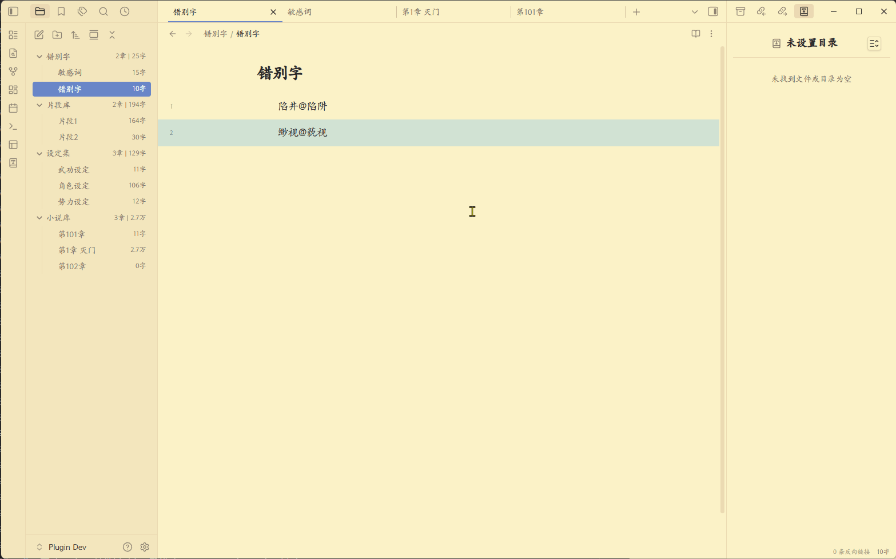

<div align="center">
	<h1>Chinese Novel Assistant - Chinese Fiction Writing Assistant</h1>
	
	
	
	
	
</div>

<hr style="border-top: 2px dashed #ccc;">

[简体中文](./README.md) | English

An Obsidian plugin designed for Chinese fiction authors, with a set of practical features ready to use out of the box.

**Note: all features are desktop-only, and have been fully tested mainly on Windows 11.**

<hr style="border-top: 2px dashed #ccc;">

## ✨ Worldbuilding library and keyword highlight

- Build and manage your own **worldbuilding library** flexibly and conveniently, with a right sidebar view for classification, sorting, and organization.
- Highlights **worldbuilding keywords** inside your manuscript. Hovering over a highlighted keyword shows the detailed entry as a writing reminder.
- Worldbuilding files are essentially **local, plain Markdown files**, so you can open and edit them directly.



<hr style="border-top: 2px dashed #ccc;">

## ✨ Quick add worldbuilding from right-click menu

- Add selected text to the worldbuilding library directly from the context menu without leaving the current page.
- You can also pre-assign the new entry to an existing category during creation.



<hr style="border-top: 2px dashed #ccc;">

## ✨ Quick reference existing worldbuilding in manuscript

- Type `//+Chinese keyword` in your manuscript to quickly reference existing entries and reduce consistency issues.
- The Chinese keyword supports **fuzzy search** and provides an IME-like dropdown candidate panel for quick selection.



<hr style="border-top: 2px dashed #ccc;">

## ✨ Sticky note feature for inspiration

- Use commands to quickly create floating inspiration sticky notes in the workspace.
- Includes a dedicated right sidebar for archiving, organizing, and searching notes.
- Each note is also an independent **Markdown file**, with fully open data.



<hr style="border-top: 2px dashed #ccc;">

## ✨ More accurate Chinese character count

- Optimized for fiction writing on top of basic character counting.
- In addition to the bottom-right counter, synced chapter/character counts are also shown in the left file explorer.



<hr style="border-top: 2px dashed #ccc;">

## ✨ Sidebar writing milestones (every 500 characters)

- Adds milestone markers near line numbers to help track chapter progress while writing.



<hr style="border-top: 2px dashed #ccc;">

## ✨ Editor typography: first-line indent, line spacing, paragraph spacing

- Configure first-line indentation, line spacing, and paragraph spacing to improve reading and writing experience.



<hr style="border-top: 2px dashed #ccc;">

## ✨ Common English punctuation detection and fix

- Automatically detects incorrect English punctuation in Chinese text.
- Provides manual commands to batch-fix detected punctuation issues.

<hr style="border-top: 2px dashed #ccc;">



## ✨ Quick insert custom text snippets

- Supports custom snippets and fast snippet insertion.
- Snippets are essentially **local Markdown files**, which you can edit directly.

<hr style="border-top: 2px dashed #ccc;">



## ✨ Custom typo and sensitive-word detection and fix

- Define your own typo/sensitive-word dictionary for detection and highlighting in manuscript text.
- Provides manual commands to batch-fix detected typos and sensitive words.



<hr style="border-top: 2px dashed #ccc;">

# Usage

## Install plugin: Method 1
1. Enable third-party/community plugins in Obsidian.
2. Create a folder named `chinese-novel-assistant` under your Obsidian plugins directory.
3. Copy `main.js`, `styles.css`, and `manifest.json` from the release assets into that folder.
4. Restart Obsidian, then enable Chinese Novel Assistant in installed plugins.

## Install plugin: Method 2
1. Enable third-party/community plugins in Obsidian.
2. In the official community plugin market, install and enable **BRAT**.
3. In BRAT settings, click **Add beta plugin**.
4. In the popup, set the plugin URL to **this GitHub repository page**, and version to **Latest Version**.
5. Click **Add plugin** and wait for installation/enable to finish.

## Configure plugin
1. Add one or more novel libraries in plugin settings.
2. The plugin will automatically create several feature folders in each novel library: worldbuilding library, sticky note library, snippet library, and proofreading dictionary library.
3. The worldbuilding library stores worldbuilding files (Markdown).
4. The sticky note library stores note files (Markdown).
5. The snippet library stores custom quick-insert snippet files (Markdown).
6. The proofreading dictionary library stores typo/sensitive-word dictionary files (Markdown).
7. See the settings page for detailed options of other features.

## Worldbuilding file format conventions

Files in the worldbuilding library should follow these conventions:
1. Each file is a worldbuilding collection; file name = collection name.
2. Each H1 (`# Heading`) in the file is a category; heading text = category name.
3. Each H2 (`## Heading`) under an H1 is an entry; heading text = entry name.
4. Content under an H2 is the detailed entry content.
5. Content after `【别名】` is treated as aliases of the entry, separated by `，`.
6. Content after `【状态】` is treated as entry status. Currently supports `死亡` (dead) and `失效` (invalid). Entries in these states are grayed out with strikethrough in the right sidebar.
7. H3 and lower headings are not parsed as entries. Standalone H2 without a valid H1 hierarchy is also not parsed.

Example:

```
# 主要角色

## 令狐冲
- 华山派大弟子，性格不羁爱自由，重视情义被正派视为不分正邪。

## 任盈盈
【别名】盈盈，圣姑
- 魔教教主任我行的女儿日月神教教主，任我行之女，东方不败尊其为圣姑，左道群豪奉若神明。
- ...

# 其他角色

## 林震南
- 【状态】死亡
- 威震江南的福威镖局总镖头，虽然武功低微，以高明生意手腕威震江南。他迎娶了洛阳金刀门王元霸之女为妻，即王夫人，两人育有一子林平之，林平之后来又娶了岳灵珊。


```

<hr style="border-top: 2px dashed #ccc;">

## Snippet format conventions

To use snippets, follow these conventions:
The title text of each H2 is treated as the snippet key. Note that keys currently support English characters only.

Example:

```

## mbsx
【等级】：
【属性】：
【技能】：
【描述】：

## gdsc
床前明月光，
疑是地上霜。
举头望明月，
低头思故乡。

```

<hr style="border-top: 2px dashed #ccc;">

## Custom typo and sensitive-word dictionary format

To use custom typo/sensitive-word detection, configure a dictionary file (Markdown) with the following rules:
1. Each line contains one wrong term and its correction, in format: `wrong_term[space]correct_term`
2. When a wrong term appears in manuscript text, it will be highlighted.
3. If a correction exists after a space, the plugin's batch-fix command will automatically replace the wrong term with the correction.

Example:

```
陷井 陷阱
缈视 藐视

```

<hr style="border-top: 2px dashed #ccc;">

## 📝 Commands

Access these commands with `Ctrl/Cmd+P`:

- **Auto-fix punctuation issues in current document** - Auto-fixes English punctuation and unmatched paired Chinese punctuation.
- **Auto-fix typos and sensitive words in current document** - Auto-fixes typos and sensitive words in current document (requires your custom dictionary).

<hr style="border-top: 2px dashed #ccc;">

## 🤝 Support

If Chinese Novel Assistant helps you, please consider supporting the project:

- [⭐ Star the project on GitHub](https://github.com/pingo8888/chinese-novel-assistant)
- [🐛 Report issues or request features](https://github.com/pingo8888/chinese-novel-assistant/issues)

<hr style="border-top: 2px dashed #ccc;">

## 📄 License

MIT License - free to use and modify.

<hr style="border-top: 2px dashed #ccc;">

**Made with ❤️ by [pingo8888](https://github.com/pingo8888)**
